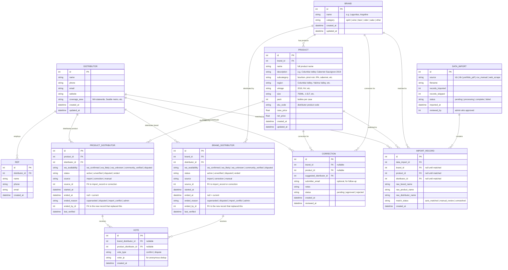

# Booze Clues — Entity Relationship Diagram

## Mermaid ERD



## Entity Summary

| Entity | Purpose |
|---|---|
| **Brand** | A brand or producer (e.g., "Lagunitas", "Angeline", "Buffalo Trace"). The top-level grouping. |
| **Product** | A specific SKU under a brand (e.g., "Angeline - California Chardonnay 2019 12/750ml"). Optional — many brands won't have products until we have SKU-level data. |
| **Distributor** | Company that distributes products in WA |
| **Rep** | Sales rep at a distributor — the human buyers actually call |
| **Brand_Distributor** | Time-bounded record: who distributes this brand. Used when we only have brand-level data (Odom PDF, Winebow scrape). |
| **Product_Distributor** | Time-bounded record: who distributes this specific product/SKU. Used when we have SKU-level data (Young's catalogs, future COLA data). |
| **Vote** | Anonymous confirm/dispute on a brand-distributor or product-distributor mapping |
| **Correction** | User-submitted "this is wrong, it should be X" — can target a brand or product |
| **Data_Import** | Tracks each bulk import (PDF upload, web scrape, CSV) |
| **Import_Record** | Individual rows from an import, pending matching to brands/products/distributors |

## Key Design Decisions

1. **Brand and Product are separate entities.** Brand is the parent, Product is the child. A brand can exist without products (brand-level data only). Products always belong to a brand. This lets us combine data sources at different granularity levels.
2. **Two distributor mapping tables.** `Brand_Distributor` for brand-level data ("Odom carries Lagunitas"). `Product_Distributor` for SKU-level data ("Young's carries Angeline California Chardonnay 2019 750ML"). Both are time-bounded with the same fields.
3. **WA availability is an enum, not a score.** The `wa_availability` field replaces a numeric confidence score because the problem is qualitative — *why* should you trust this mapping — not quantitative. Values:
   - `wa_confirmed` — source explicitly filtered to WA market, or distributor is WA-only
   - `wa_likely` — distributor operates in WA, catalog titled "Washington", but not explicitly filtered to WA
   - `wa_self_distributed` — brand name matches distributor name (self-distributing producer). WA availability confirmed by active LCB license.
   - `wa_historical` — data from a source that is no longer current (e.g., 2021 Young's Market catalog pre-RNDC acquisition). Mapping may have changed since.
   - `wa_unknown` — national/regional catalog, may or may not be available in WA
   - `community_verified` — a human (Chris, industry contact, user) confirmed WA availability
   - `disputed` — someone flagged this as incorrect or not available in WA
4. **Search queries both levels.** A search for "Lagunitas" hits the brand table and returns the brand-level distributor mapping. A search for "Cabernet Sauvignon" hits the product table and returns SKU-level results grouped by brand.
5. **Brand dedup is critical.** When loading SKU-level data, we must match the brand name to an existing brand or create a new one. Fuzzy matching (Levenshtein + normalization) handles cases like "ANGELINE" vs "Angeline Wines".
6. **Product_Distributor and Brand_Distributor are both time-bounded, not mutable.** Each row has `started_at` and `ended_at`. The current distributor is where `ended_at IS NULL`. Full history preserved.
7. **Provenance is tracked.** Each mapping row knows its `source` and `source_id`. Every fact is traceable to where it came from.
8. **End reasons are explicit.** `superseded`, `disputed`, `import_conflict`, `admin`. `ended_by_id` links to the replacement record.
9. **Votes are anonymous** — no user accounts needed for MVP. IP-based dedup prevents spam.
10. **Corrections can target brand or product level.** A correction says "wrong, and here's who it should be." Approved corrections create a new mapping row and end the old one.
11. **Rep is optional but valuable.** Supports the "Connect with Rep" action in the UI.
12. **No user accounts table in MVP.** Accounts come in Phase 2.

## WA Availability by Source

| Source | wa_availability | Rationale |
|---|---|---|
| Winebow (WA market filter) | `wa_confirmed` | Explicitly filtered to Washington market on their website |
| Young's WA Wines | `wa_confirmed` | WA-specific presentation, all products are Washington wines |
| Dickerson Distributors | `wa_confirmed` | WA-only distributor (Whatcom/Skagit/Island/San Juan) |
| NW Wine & Spirits | `wa_confirmed` | WA-only distributor |
| Young's Full Catalog | `wa_historical` | 2021 catalog, pre-RNDC acquisition. Distributor no longer exists. Mappings may be stale. |
| Young's WA Wines | `wa_historical` | 2021 WA-specific presentation. Products confirmed WA at the time but distributor changed. |
| Odom Corp PDF | `wa_likely` | PNW catalog — they operate in WA but PDF says "may not be available in all states" |
| Columbia/Coldist VTinfo | `wa_likely` | Scraped WA-specific brand builder URL, but not verified that all brands are WA |
| Olympic Eagle VTinfo | `wa_likely` | PNW distributor, WA is primary market |
| TTB COLA (future) | `wa_unknown` | Federal data — product approved for US sale, but WA distribution not confirmed |
| Community submissions | `community_verified` | Human confirmed this is available in WA |

## Querying Patterns

### Brand-level queries
- **Current distributor for a brand:** `SELECT * FROM brand_distributor WHERE brand_id = ? AND ended_at IS NULL AND status = 'active'`
- **Full history for a brand:** `SELECT * FROM brand_distributor WHERE brand_id = ? ORDER BY started_at`

### Product-level queries
- **Current distributor for a product:** `SELECT * FROM product_distributor WHERE product_id = ? AND ended_at IS NULL AND status = 'active'`
- **All products for a brand:** `SELECT * FROM product WHERE brand_id = ?`

### Search queries
- **Search by name (brands + products):**
  ```sql
  -- Brand results
  SELECT b.*, bd.confidence_score, d.name as distributor_name
  FROM brand b
  JOIN brand_distributor bd ON bd.brand_id = b.id AND bd.ended_at IS NULL
  JOIN distributor d ON d.id = bd.distributor_id
  WHERE b.name MATCH ?

  UNION ALL

  -- Product results
  SELECT p.*, pd.confidence_score, d.name as distributor_name
  FROM product p
  JOIN product_distributor pd ON pd.product_id = p.id AND pd.ended_at IS NULL
  JOIN distributor d ON d.id = pd.distributor_id
  WHERE p.name MATCH ? OR p.description MATCH ?
  ```

### Analytics queries
- **All active disputes:** `SELECT * FROM brand_distributor WHERE status = 'disputed' AND ended_at IS NULL UNION SELECT * FROM product_distributor WHERE status = 'disputed' AND ended_at IS NULL`
- **What changed in the last 30 days:** Filter both mapping tables by `started_at` or `ended_at` within range.
- **Products per brand:** `SELECT b.name, COUNT(p.id) FROM brand b LEFT JOIN product p ON p.brand_id = b.id GROUP BY b.id`
- **Brands with products vs. brand-only:** `SELECT b.name, CASE WHEN COUNT(p.id) > 0 THEN 'has products' ELSE 'brand only' END FROM brand b LEFT JOIN product p ON p.brand_id = b.id GROUP BY b.id`

## Data Flow by Source

| Source | Data Level | Creates |
|---|---|---|
| Odom Corp PDF | Brand only | `brand` + `brand_distributor` |
| Winebow web scrape | Brand only | `brand` + `brand_distributor` |
| Young's Full Catalog | SKU-level | `brand` + `product` + `product_distributor` |
| Young's WA Wines | SKU-level | `brand` + `product` + `product_distributor` |
| Columbia/Coldist (future) | Brand only | `brand` + `brand_distributor` |
| TTB COLA (future) | Product-level | `brand` + `product` + `product_distributor` |
| Community CSV | Either | Depends on what's submitted |
| Portfolio PDFs | Usually SKU-level | `brand` + `product` + `product_distributor` |

## Future: Manufacturer Data + Mechanistic Ranker (Post-MVP)

### Manufacturer Data Pipeline
A data source where manufacturers/brands submit rich product metadata directly: tasting notes, ABV, origin, awards, imagery, pairings, MSRP. Turns the platform from a phone book into a product discovery engine.

This extends the PRODUCT entity with a `product_metadata` table for extensibility, or adds fields directly to PRODUCT as they prove valuable.

### Mechanistic Ranker
Replace heuristic confidence scoring with an algorithmic ranker that weighs multiple signals:

| Signal | Description |
|---|---|
| Source reliability | Manufacturer-confirmed > distributor catalog > LCB import > single user vote |
| Recency | Recently verified mappings rank higher |
| Corroboration | Multiple independent sources confirming the same mapping |
| Source track record | Historical accuracy of past imports from this source |
| Relationship stability | Long-standing mappings rank higher than frequently-changing ones |
| Dispute velocity | How quickly votes are accumulating against a mapping |

The time-bounded mapping tables support this — all historical data needed to train and run the ranker is already being captured.
